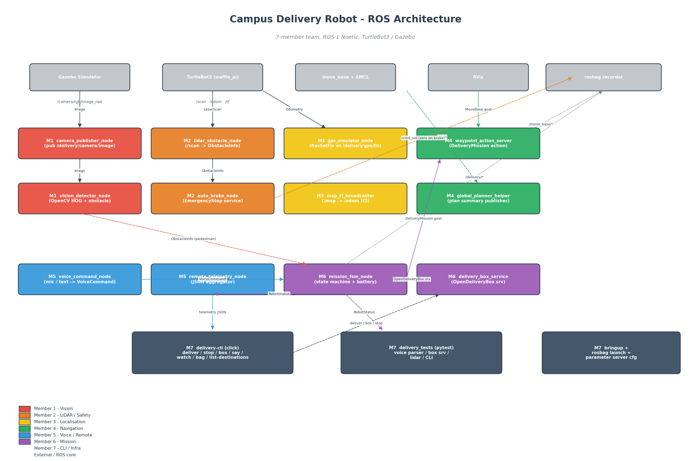

# Campus Delivery Robot

A simulated small autonomous delivery robot for a university campus, built on **ROS 1 Noetic** with **TurtleBot3** and **Gazebo**. The robot takes a voice (or CLI) delivery command, plans a path to a campus destination, avoids obstacles and pedestrians, opens its delivery box on arrival, and returns home.

This project is the group submission for the *Smart Mobility Engineering* course.

---

## Demo flow

```
Voice / CLI command  →  Get GPS destination  →  Plan path  →  Move  →
   Avoid obstacles  →  Stop for pedestrians  →  Reach destination  →
   Open delivery box  →  Return home  →  Idle
```

The full operational flowchart and the ROS architecture diagram live in [`docs/`](docs/).



---

## Team and contributions (7 members)

Every member owns at least two ROS functions. Source files are tagged with the owner at the top of the file so individual contributions are easy to audit.

| Member | Area | Package | ROS Functions |
|--------|------|---------|---------------|
| **M1** | Vision Perception | `delivery_perception_vision` | `camera_publisher_node` (Publisher), `vision_detector_node` (Subscriber + OpenCV HOG + custom message Publisher) |
| **M2** | LiDAR & Safety | `delivery_perception_lidar` | `lidar_obstacle_node` (Subscriber/Publisher on `/scan`), `auto_brake_node` (Service server `EmergencyStop`) |
| **M3** | Localization & TF | `delivery_localization` | `gps_simulator_node` (NavSatFix publisher), `map_tf_broadcaster_node` (tf2 broadcaster + `/initialpose` subscriber) |
| **M4** | Navigation | `delivery_navigation` | `waypoint_action_server_node` (Action server, `DeliveryMission`), `global_planner_helper_node` (plan summary publisher) |
| **M5** | Voice & Remote | `delivery_voice_remote` | `voice_command_node` (Publisher + grammar parser), `remote_telemetry_node` (multi-Subscriber JSON aggregator) |
| **M6** | Mission Control | `delivery_mission` | `delivery_box_service_node` (Service server `OpenDeliveryBox`), `mission_fsm_node` (Action client + state machine) |
| **M7** | CLI, Tests, Infra | `delivery_cli`, `delivery_tests`, `delivery_robot_bringup` | Click-based CLI, pytest suite, top-level launch + parameter server config + rosbag launch |

---

## Repository layout

```
campus_delivery_robot/
├── src/                                       # Catkin workspace source
│   ├── delivery_msgs/                         # Shared messages, services, action
│   ├── delivery_perception_vision/   (M1)
│   ├── delivery_perception_lidar/    (M2)
│   ├── delivery_localization/        (M3)
│   ├── delivery_navigation/          (M4)
│   ├── delivery_voice_remote/        (M5)
│   ├── delivery_mission/             (M6)
│   ├── delivery_cli/                 (M7)
│   ├── delivery_tests/               (M7)
│   └── delivery_robot_bringup/       (M7) ── top-level launch, RViz cfg
├── scripts/                                   # Diagram generators, utilities
├── docs/                                      # Architecture diagram, flowchart, report
├── bag/                                       # rosbag recordings land here
└── README.md
```

---

## Quick start

### 1. Prerequisites

Tested on **Ubuntu 20.04** with **ROS 1 Noetic** and **Gazebo 11**.

```bash
sudo apt install ros-noetic-desktop-full \
                 ros-noetic-turtlebot3 \
                 ros-noetic-turtlebot3-simulations \
                 ros-noetic-turtlebot3-navigation \
                 ros-noetic-navigation \
                 ros-noetic-gmapping \
                 ros-noetic-map-server \
                 python3-pip
pip3 install --user click opencv-python SpeechRecognition pytest
```

### 2. Build the workspace

```bash
mkdir -p ~/campus_ws/src
cp -r campus_delivery_robot/src/* ~/campus_ws/src/
cd ~/campus_ws
catkin_make
source devel/setup.bash
echo "export TURTLEBOT3_MODEL=waffle_pi" >> ~/.bashrc
source ~/.bashrc
```

### 3. Install the click CLI

```bash
cd ~/campus_ws/src/delivery_cli
pip3 install --user -e .
# delivery-cli should now be on your PATH
delivery-cli --help
```

### 4. Generate a map (one-time)

Use the standard TurtleBot3 SLAM tutorial to make `house_map.yaml` and `house_map.pgm`, drop them into `delivery_robot_bringup/maps/`:

```bash
roslaunch turtlebot3_gazebo turtlebot3_house.launch
roslaunch turtlebot3_slam turtlebot3_slam.launch slam_methods:=gmapping
# drive around with teleop_keyboard, then in another shell:
rosrun map_server map_saver -f ~/campus_ws/src/delivery_robot_bringup/maps/house_map
```

### 5. Launch the full system

```bash
roslaunch delivery_robot_bringup delivery_robot_full.launch
```

This single command starts Gazebo, TurtleBot3, AMCL, move_base, every team member's nodes, and RViz.

### 6. Drive a mission from the CLI

In another terminal:

```bash
source ~/campus_ws/devel/setup.bash

delivery-cli list-destinations          # see available targets
delivery-cli deliver library            # send a mission
delivery-cli status --follow            # watch the FSM in real time
delivery-cli watch                      # stream JSON telemetry
delivery-cli stop                       # engage the brake
delivery-cli resume                     # release the brake
delivery-cli box open                   # manually open the delivery box
delivery-cli say "deliver to the cafe"  # simulate a voice command
```

### 7. Record a session (mandatory rosbag)

```bash
# In one terminal: launch the system
roslaunch delivery_robot_bringup delivery_robot_full.launch

# In another: start recording (writes into bag/)
roslaunch delivery_robot_bringup record_session.launch bag_prefix:=demo_run1

# Or use the CLI wrapper (lets you stop it with Ctrl-C cleanly):
delivery-cli bag start --name demo_run1
delivery-cli bag list
delivery-cli bag stop
```

Replay later with `rosbag play bag/demo_run1*.bag`.

---

## Running tests

Pure pytest (no ROS master needed):

```bash
cd ~/campus_ws/src/delivery_tests
pytest tests/test_voice_parser.py -v
pytest tests/test_cli.py -v
```

Integration tests (with a ROS master):

```bash
roscore &
roslaunch delivery_mission delivery_mission.launch &
pytest tests/test_delivery_box_service.py --with-ros -v
```

Or via `rostest`:

```bash
rostest delivery_tests test_voice_parser.test
rostest delivery_tests test_delivery_box_service.test
```

---

## ROS functions checklist (project requirement)

| Concept | Where it lives |
|---------|----------------|
| Publisher | `camera_publisher_node`, `gps_simulator_node`, … |
| Subscriber | `vision_detector_node`, `lidar_obstacle_node`, `remote_telemetry_node`, … |
| Service (server) | `auto_brake_node` (EmergencyStop), `delivery_box_service_node` (OpenDeliveryBox) |
| Service (client) | `delivery-cli`, `mission_fsm_node` |
| Action (server) | `waypoint_action_server_node` (DeliveryMission) |
| Action (client) | `mission_fsm_node`, `delivery-cli deliver` |
| Custom Messages | `delivery_msgs/ObstacleInfo`, `RobotStatus`, `VoiceCommand` |
| Parameter Server | `delivery_robot_bringup/config/move_base_overrides.yaml` (max speed, safety distance), `waypoints.yaml` |
| tf2 | `map_tf_broadcaster_node`, navigation action server uses tf2 buffer |
| rosbag | `record_session.launch`, `delivery-cli bag` |
| RViz | `delivery_robot.rviz` |
| roslaunch | every package has its own launch file; `delivery_robot_full.launch` ties them together |
| rostopic / rosservice (CLI usage) | exercised from `delivery-cli watch` / `status` / `box` |
| Advanced CLI (Click) | `delivery_cli` package |
| Pytest scenarios | `delivery_tests/tests/test_*.py` |
| Well-commented code | every node has a module docstring and inline comments |

---

## Troubleshooting

- **`No module named delivery_msgs`** — you forgot to `source devel/setup.bash` after `catkin_make`.
- **`No transform from base_link to map`** — AMCL has not converged. Use the `2D Pose Estimate` tool in RViz to seed it.
- **Camera nodes complain about `bgr8`** — make sure `TURTLEBOT3_MODEL=waffle_pi`. Burger has no camera.
- **`delivery-cli` not found** — run `pip3 install --user -e src/delivery_cli` and ensure `~/.local/bin` is on `$PATH`.
- **Voice node says `microphone init failed`** — that's expected on headless systems. Set `voice_mode:=text` and use `delivery-cli say "..."`.

---

## License

MIT. See `LICENSE`.
